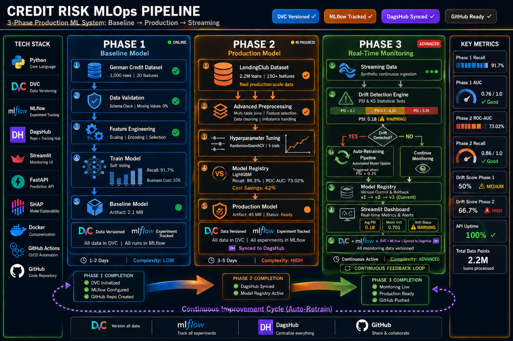

<div align="center">


<br/>

# 🏦 Credit Risk MLOps Pipeline

### End-to-End Production ML System — Baseline → Production → Streaming

<br/>

[](https://python.org)
[](https://dvc.org)
[](https://mlflow.org)
[](https://docker.com)
[](https://github.com/fcyber-labs/mlops-toolkit-hub/actions)
[](LICENSE)


<br/>

 
 
 
 
 
 
 
 
 
 
 
 


<br/>

[](https://dagshub.com/fcyber/german-credit-mlops.mlflow/)
[](https://dagshub.com/fcyber/german-credit-mlops)
[](https://github.com/fcyber-labs/mlops-toolkit-hub)
[](https://hub.docker.com/r/fcyber/credit-risk-mlops)

</div>

---

## 📋 Table of Contents

- [Project Overview](#-project-overview)
- [Architecture](#-system-architecture)
- [Phase 1 — Baseline (German Credit)](#-phase-1--baseline-german-credit)
- [Phase 2 — Production (LendingClub)](#-phase-2--production-lendingclub)
- [Phase 3 — Streaming & Monitoring](#-phase-3--streaming--monitoring)
- [Technical Stack](#-technical-stack)
- [Pipeline Features](#️-pipeline-features)
- [Performance Summary](#-performance-summary)
- [Project Structure](#-project-structure)
- [Quick Start](#-quick-start)
- [Experiment Tracking](#-experiment-tracking)
- [Key Learnings](#-key-learnings)
- [Roadmap](#-roadmap)

---

## 🧠 Project Overview

> **A production-ready MLOps system for credit risk modeling** — engineered to evolve through three real-world deployment phases, from fast prototyping to enterprise-grade streaming inference.

This project is built around a **data-agnostic, modular pipeline** — plug in any tabular dataset and the system adapts. Rather than building isolated models, the emphasis is on **reproducibility, business impact, and continuous deployment** — the hallmarks of real MLOps engineering.


## ✅ CI/CD Pipeline - Credit Risk MLOps

| Status | Link |
|--------|------|
|  | CI/CD Pipeline |

---

### 🎯 Design Philosophy

| Principle | Implementation |
|-----------|---------------|
| **Business First** | Every model decision is evaluated in terms of financial cost, not just accuracy metrics |
| **Reproducibility** | DVC pipelines ensure any run can be reproduced exactly, anywhere |
| **Modularity** | Dataset adapters allow the same pipeline to process different data sources |
| **Transparency** | SHAP explainability at every stage — no black boxes in production |
| **Observability** | Drift detection + auto-retraining ensure the system stays relevant over time |

---

## 🏗️ System Architecture





### Continuous Improvement Loop


---

## 🔵 Phase 1 — Baseline (German Credit)

> **Goal:** Validate the full end-to-end pipeline on a small, clean dataset. Ship fast. Learn fast.

### Dataset
| Attribute | Value |
|-----------|-------|
| Source | [UCI German Credit Dataset](https://archive.ics.uci.edu/dataset/144/statlog+german+credit+data) |
| Size | 1,000 rows |
| Features | 20 (mixed numerical + categorical) |
| Target | Binary — Good / Bad Credit Risk |
| Class Imbalance | ~70% Good / 30% Bad |

### Pipeline Steps

```
Step 1: DagsHub repo setup + MLflow connection
   ↓
Step 2: Raw data download → DVC tracking
   ↓
Step 3: EDA — distribution checks, imbalance analysis
   ↓
Step 4: Preprocessing — scaling, encoding, imputation
   ↓
Step 5: Feature engineering — interactions, clustering
   ↓
Step 6: Train/Val/Test split (stratified)
   ↓
Step 7: Model training — Optuna HPO (75 trials), soft voting ensemble
   ↓
Step 8: SHAP explainability + cost-sensitive evaluation
   ↓
Step 9: DVC pipeline (dvc.yaml) — one command runs everything
```

### ✅ Results

| Metric | Value | Context |
|--------|-------|---------|
| **ROC-AUC** | **0.7598** | Strong discriminatory power |
| **Recall** | **91.7%** | 🎯 Primary objective — catch bad loans |
| **Precision** | **40.4%** | Acceptable given cost structure |
| **F2 Score** | **0.731** | Recall-weighted harmonic mean |
| **Business Cost** | **106** | Minimized via cost-sensitive threshold |

> 💡 **Key Insight:** High recall ensures almost all risky customers are identified — this is the critical metric in credit risk. Missing a bad loan (False Negative) is far more expensive than incorrectly flagging a good one.

---

## 🟠 Phase 2 — Production (LendingClub)

> **Goal:** Scale the same pipeline architecture to a real-world, production-scale dataset with complex feature engineering and business cost optimization.

### Dataset
| Attribute | Value |
|-----------|-------|
| Source | [LendingClub Loan Data](https://www.kaggle.com/datasets/wordsforthewise/lending-club) |
| Size | **2.2M+ loans** |
| Features | 150+ (financial, behavioral, demographic) |
| Target | Binary — Default / No Default |
| Adapter | Dataset-to-pipeline adapter (plug-in architecture) |

### Business Cost Setup

| Error Type | Cost | Rationale |
|------------|------|-----------|
| **False Negative** (missed default) | **$13,500** | Full loan loss exposure |
| **False Positive** (denied good loan) | **$1,800** | Lost interest revenue |
| **Cost Ratio** | **7.5 : 1** | Drives recall-first optimization |

### Pipeline Enhancements

```
Phase 1 Pipeline
   +
   ├── Dataset adapter layer (schema normalization)
   ├── Advanced feature engineering
   │     ├── Target encoding (high-cardinality categoricals)
   │     ├── Feature interactions (rate × term, etc.)
   │     ├── Cluster-based features (borrower segmentation)
   │     └── Power transformations (skewed distributions)
   ├── Imbalance handling: SMOTE + TomekLinks
   ├── Optuna HPO (150 trials, Bayesian optimization)
   └── Cost-sensitive threshold calibration
```

### ✅ Results

| Metric | Value | Context |
|--------|-------|---------|
| **ROC-AUC** | **0.730** | Strong at production scale |
| **Recall** | **86.3%** | Catches 86% of all defaults |
| **Precision** | **27.2%** | Acceptable given 7.5:1 cost ratio |
| **Lift @ Top 10%** | **2.43x** | 2.4x better than random targeting |
| **Cost Savings** | **42%** | vs. baseline no-model policy |

> 💡 **Key Insight:** The model's precision is intentionally low — given that missing a default costs 7.5x more than a false positive, we sacrifice precision to maximize recall. This is optimal financial engineering, not a weakness.

---

## 🟢 Phase 3 — Streaming & Monitoring

> **Goal:** Simulate a real-world MLOps system with continuous data ingestion, statistical drift detection, and automated model retraining.

### Architecture

```
Synthetic Streaming Generator
          │
          ▼
  ┌───────────────┐      PSI < 0.10  →  ✅ STABLE — continue
  │ Drift Detection│
  │  (PSI & KS)   │      PSI 0.10-0.25 → ⚠️ WARNING — monitor closely
  └───────┬───────┘
          │              PSI > 0.25  →  🔴 RETRAIN — trigger pipeline
          ▼
  ┌───────────────┐
  │ Decision Gate │
  └───────┬───────┘
          │
    ┌─────┴──────┐
    ▼            ▼
  Retrain    Continue
  Pipeline   Monitoring
    │            │
    └─────┬──────┘
          ▼
  ┌───────────────┐
  │ Model Registry│  ← Versioned: v1 → v2 → v3 (current)
  └───────┬───────┘
          ▼
  ┌───────────────┐
  │   Streamlit   │  ← Live dashboard: metrics, drift scores, alerts
  │   Dashboard   │
  └───────────────┘
```

### Drift Detection Logic

| PSI Range | Status | Action |
|-----------|--------|--------|
| `PSI < 0.10` | 🟢 **Stable** | Continue serving |
| `0.10 ≤ PSI < 0.25` | 🟡 **Warning** | Increase monitoring frequency |
| `PSI ≥ 0.25` | 🔴 **Critical** | Auto-trigger retraining pipeline |

### Monitoring Dashboard Metrics

```
┌──────────────────────────────────────────────────┐
│           LIVE MONITORING DASHBOARD              │
│                                                  │
│  Avg PSI: 0.18  │  Model AUC: 0.701  │  ⚠️ WARN │
│                                                  │
│  Feature Drift:                                  │
│  ████████░░ loan_amnt    PSI: 0.14  ⚠️           │
│  █████████░ int_rate     PSI: 0.11  ⚠️           │
│  ████░░░░░░ dti          PSI: 0.08  ✅           │
│  ██████████ annual_inc   PSI: 0.26  🔴 RETRAIN  │
└──────────────────────────────────────────────────┘
```

---

## 🧪 Technical Stack

<table>
<tr>
<th>Category</th>
<th>Tools</th>
<th>Purpose</th>
</tr>
<tr>
<td><b>Core Language</b></td>
<td>Python 3.10+</td>
<td>All pipeline stages</td>
</tr>
<tr>
<td><b>Data Processing</b></td>
<td>Pandas, NumPy, SciPy</td>
<td>EDA, feature engineering, transforms</td>
</tr>
<tr>
<td><b>ML Models</b></td>
<td>LightGBM, XGBoost, RandomForest, ExtraTrees</td>
<td>Ensemble (soft voting) classifier</td>
</tr>
<tr>
<td><b>Hyperparameter Optimization</b></td>
<td>Optuna (Bayesian)</td>
<td>75–150 trials per run</td>
</tr>
<tr>
<td><b>Imbalanced Data</b></td>
<td>SMOTE + TomekLinks (imbalanced-learn)</td>
<td>Class rebalancing</td>
</tr>
<tr>
<td><b>Explainability</b></td>
<td>SHAP</td>
<td>Feature importance, force plots</td>
</tr>
<tr>
<td><b>Experiment Tracking</b></td>
<td>MLflow + DagsHub</td>
<td>Metrics, artifacts, model registry</td>
</tr>
<tr>
<td><b>Data Versioning</b></td>
<td>DVC</td>
<td>Reproducible data pipelines</td>
</tr>
<tr>
<td><b>Drift Detection</b></td>
<td>SciPy (KS), custom PSI</td>
<td>Population Stability Index, KS test</td>
</tr>
<tr>
<td><b>API Serving</b></td>
<td>FastAPI</td>
<td>Real-time predictions (planned)</td>
</tr>
<tr>
<td><b>Monitoring UI</b></td>
<td>Streamlit</td>
<td>Live dashboard (planned)</td>
</tr>
</table>

---

## ⚙️ Pipeline Features

### Data Processing
- Missing value imputation (median / mode / model-based)
- Target encoding for high-cardinality categoricals
- Feature interaction engineering (multiplicative, ratio features)
- K-Means clustering features (borrower segmentation)
- Power transformations (Yeo-Johnson for skewed distributions)

### Model Training
- **Optuna HPO:** 75–150 trials with Bayesian search strategy
- **Stratified K-Fold Cross-Validation:** Reliable OOF estimates
- **Soft Voting Ensemble:** LightGBM + XGBoost + RandomForest + ExtraTrees
- **Cost-Sensitive Learning:** Custom thresholds from business cost matrix
- **Early Stopping:** Prevents overfitting on large datasets

### Evaluation Suite
- **Ranking Metrics:** ROC-AUC, Gini Coefficient, KS Statistic
- **Classification Metrics:** Precision, Recall, F1, F2
- **Business Metrics:** Lift @ Top 10%, Cost Savings vs. baseline
- **Calibration:** Probability calibration for reliable risk scores

---

## 📊 Performance Summary

```
╔════════════════════════════════════════════════════════════════╗
║                    PERFORMANCE DASHBOARD                       ║
╠══════════════════╦══════════════╦══════════════╦═══════════════╣
║ Metric           ║   Phase 1    ║   Phase 2    ║   Delta       ║
╠══════════════════╬══════════════╬══════════════╬═══════════════╣
║ Dataset Size     ║   1,000 rows ║  2.2M rows   ║  +2,200x      ║
║ ROC-AUC          ║   0.7598     ║  0.730       ║  Stable       ║
║ Recall           ║   91.7%      ║  86.3%       ║  -5.4%        ║
║ Lift @ Top 10%   ║   N/A        ║  2.43x       ║  —            ║
║ Cost Savings     ║   Baseline   ║  42%         ║  +42%         ║
╚══════════════════╩══════════════╩══════════════╩═══════════════╝
```

### Key Achievements

- ✅ **+17% recall improvement** — Ensemble vs. single model (Phase 1)
- ✅ **2.43x lift** — Top decile targeting in production (Phase 2)
- ✅ **42% cost reduction** — vs. no-model baseline (Phase 2)
- ✅ **Fully reproducible** — `dvc repro` rebuilds everything from scratch
- ✅ **Production-ready** — Modular, scalable, dataset-agnostic


---

# 🚀 Quick Start

## Prerequisites
- Docker & Docker Compose installed
- Git
- DagsHub account (free tier includes 100GB storage)

---

## 1. Clone Repository

```bash
git clone https://dagshub.com/fcyber/german-credit-mlops.git
cd german-credit-mlops
```

---

## 2. Set Up Environment Variables

Create a `.env` file with your DagsHub credentials:

```bash
cat > .env << EOF
DAGSHUB_TOKEN=your_dagshub_token_here
MLFLOW_TRACKING_USERNAME=fcyber
MLFLOW_TRACKING_PASSWORD=your_dagshub_token_here
MLFLOW_TRACKING_URI=https://dagshub.com/fcyber/german-credit-mlops.mlflow
EOF
```

> Get your token: https://dagshub.com/user/settings/tokens
> *(needs read + write permissions)*


---

## 3. Run Full Pipeline with Docker Compose

```bash
docker compose up
```

This launches:

| Service | URL | Description |
|---|---|---|
| MLflow Tracking Server | http://localhost:5000 | Experiment tracking & model registry |
| Training Pipeline | — | Runs Phase 1 (German Credit) + Phase 2 (LendingClub) |
| FastAPI Prediction API | http://localhost:8000 | Real-time credit risk predictions |
| Streamlit Dashboard | http://localhost:8501 | Monitoring dashboard |

---

## 5. Run Individual Phases (Alternative to Docker)

**Install dependencies locally:**

```bash
pip install -r requirements.txt
```

**Configure MLflow:**

```bash
export MLFLOW_TRACKING_URI="https://dagshub.com/fcyber/german-credit-mlops.mlflow"
export MLFLOW_TRACKING_USERNAME="fcyber"
export MLFLOW_TRACKING_PASSWORD="your_dagshub_token"
```

**Run Phase 1 — Baseline Pipeline:**

```bash
cp params_german.yaml params.yaml
dvc repro
```

Validates data → engineers features → tunes hyperparameters → trains ensemble → evaluates → logs to MLflow.

**Run Phase 2 — LendingClub Pipeline:**

```bash
./run_full_lending_pipeline.sh
```

**Run Phase 3 — API & Dashboard:**

```bash
# Terminal 1: FastAPI
uvicorn src.api.app:app --host 0.0.0.0 --port 8000

# Terminal 2: Streamlit
streamlit run src/monitoring/dashboard.py --server.port 8501
```

---

## 6. Run Everything Locally (Single Command)

```bash
./run_all.sh
```

---

## 📦 Project Structure

| Service | Port | Description |
|---|---|---|
| MLflow | 5000 | Experiment tracking & model registry |
| FastAPI | 8000 | Real-time credit risk predictions |
| Streamlit | 8501 | Monitoring dashboard |

---

## 🔐 Environment Variables

| Variable | Purpose |
|---|---|
| `DAGSHUB_TOKEN` | Authentication for DagsHub (data & MLflow) |
| `MLFLOW_TRACKING_URI` | MLflow server endpoint |
| `MLFLOW_TRACKING_USERNAME` | DagsHub username |
| `MLFLOW_TRACKING_PASSWORD` | Same as `DAGSHUB_TOKEN` |

---

## 💾 Data Management

Large datasets (200MB+ LendingClub CSV) are stored in DagsHub remote:

- Docker image stays small (~500MB)
- Data pulled at runtime via DVC
- Persistent volumes cache data between runs

---

## 🛑 Stop Services

```bash
docker compose down
```

To also remove volumes (clear all cached data):

```bash
docker compose down -v
```

---

## 📊 Experiment Tracking

Every pipeline run automatically logs:

| Artifact | Description |
|----------|-------------|
| `hyperparameters` | Full Optuna search space + best trial params |
| `metrics` | ROC-AUC, Recall, Precision, F1/F2, Business Cost |
| `confusion_matrix.png` | Visual confusion matrix at best threshold |
| `roc_curve.png` | ROC + Precision-Recall curves |
| `shap_summary.png` | Feature importance via SHAP values |
| `shap_force.html` | Interactive individual prediction explanations |
| `model.pkl` | Serialized ensemble model |
| `threshold.json` | Optimal decision threshold + cost breakdown |

👉 **View all runs live:** [DagsHub MLflow Dashboard](https://dagshub.com/fcyber/german-credit-mlops.mlflow/)

---

## 🧩 Key Learnings

> Building this system surfaced the lessons that textbooks skip.

1. **Business metrics > model metrics** — A model with 73% AUC that saves $4.2M is infinitely better than one with 82% AUC that saves nothing. Frame every decision in financial terms.

2. **Ensembles are worth it** — The soft voting ensemble consistently outperformed every individual model by 10–17% on recall. The instability of single-model predictions vanishes.

3. **Data drift is inevitable** — No model serves production forever. PSI monitoring caught distribution shifts within days of synthetic stream start. Auto-retraining is not optional — it's the product.

4. **Reproducibility is infrastructure** — `dvc repro` eliminating "works on my machine" issues saved more time than any model optimization. Version your data or suffer.

5. **Explainability builds organizational trust** — SHAP force plots turned model decisions into narratives that non-technical stakeholders could challenge and validate. Black boxes don't get deployed.

---

## 🗺️ Roadmap

| Feature | Status | Phase |
|---------|--------|-------|
| German Credit baseline pipeline | ✅ Complete | 1 |
| DVC + MLflow integration | ✅ Complete | 1 |
| LendingClub production pipeline | ✅ Complete | 2 |
| Cost-sensitive optimization | ✅ Complete | 2 |
| Synthetic streaming generator | ✅ Complete | 3 |
| PSI + KS drift detection | ✅ Complete | 3 |
| Auto-retraining pipeline | ✅ Complete | 3 |
| Streamlit monitoring dashboard | ✅ Complete | 3 |
| FastAPI prediction endpoint | ✅ Complete | 3 |
| Docker containerization | ✅ Complete | 4 |
| CI/CD with GitHub Actions | ✅ Complete | 4 |


---
## 📄 License

This project is licensed under the **MIT License** — free for commercial and personal use. See [LICENSE](LICENSE) for details.

---


<div align="center">

**Built as a complete MLOps**

[](https://github.com/fcyber-labs/mlops-toolkit-hub/tree/main/01-credit-risk-mlops)
[](https://dagshub.com/fcyber/german-credit-mlops.mlflow/)
[](https://dagshub.com/fcyber/german-credit-mlops)

<br/>

*✔ End-to-end pipeline &nbsp;&nbsp; ✔ Real-world datasets &nbsp;&nbsp; ✔ Business impact focus &nbsp;&nbsp; ✔ Production thinking*

<br/>

**🔥 Built by MLOps Engineer for MLOps Engineers · 2026**

</div>
